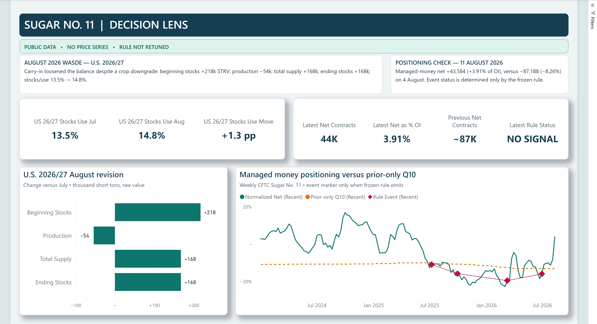

# Sugar No. 11: positioning × USDA vintage intelligence

An auditable research artifact that transfers one frozen positioning rule from cocoa to Sugar
No. 11, then puts a point-in-time USDA U.S./Mexico sugar supply-and-demand vintage tracker beside
it in a source-controlled Power BI report.

This is deliberately not a trading system or a polished chart built on hidden inputs. It uses
prior-only thresholds, release-lag handling, append-only vintages, unit checks, content hashes
and an offline test suite.

## What the artifact shows

- **Positioning:** 885 weekly CFTC Disaggregated Futures-Only releases for Sugar No. 11
  (`080732`), from 1 September 2009 through 11 August 2026.
- **A frozen cross-market rule:** managed-money net divided by total open interest; an expanding
  prior-only empirical Q10; reversal after the previous release was at/below Q10; 91 elapsed-day
  cooldown; no sugar-specific retuning.
- **Fundamentals:** 15 public USDA WASDE structured artifacts from May 2025 through August 2026,
  retained as 1,170 long-form U.S. and Mexico sugar facts plus 1,064 explicit revision rows.
- **Current research read:** August loosened the U.S. 2026/27 balance versus July despite a
  54-thousand-short-ton production reduction: higher carry-in lifted total supply and ending
  stocks by 168 thousand short tons, and the reported stocks/use value rose from 13.5 to 14.8.
- **Auditability:** every public extract retains official URL and availability provenance plus an
  extract checksum; single-artifact sources also retain upstream size/hash metadata in
  [`data/source_manifest.csv`](data/source_manifest.csv).

The latest CFTC observation in the frozen sample has normalized managed-money net of +3.91%,
versus a prior-only Q10 of -13.12%. The latest emitted rule condition is the report dated
30 June 2026, published on 6 July under the retained CFTC schedule and independently matched to
the official weekly page. These are research states, not price forecasts.

## Power BI report

For the quickest review, open the validated
[`powerbi/SugarNo11.pbix`](powerbi/SugarNo11.pbix) in Power BI Desktop. It contains populated import
data and needs no refresh, credentials, absolute paths or network access. It was saved, closed,
reopened from disk and queried against the expected 885 / 1,170 / 1,064 row counts; the exact hash
and validation checks are in [`powerbi/VALIDATION.md`](powerbi/VALIDATION.md).

The auditable source project is [`powerbi/SugarNo11.pbip`](powerbi/SugarNo11.pbip). It has two pages:

1. **Decision Lens** — positioning/Q10 context and the July-to-August 2026 U.S. balance revision.
2. **Audit & Sources** — availability fields, raw/normalized units, correction flags and provenance.

The model generator verifies the committed CSVs in [`data/derived`](data/derived), then embeds raw
Base64-encoded CSV snapshots in Power Query. Refresh therefore needs no machine-specific
path, database, credential, broker or licensed ICE feed. The text-based PBIP/PBIR/TMDL definitions
remain reviewable in Git.



## Reproduce offline

```text
python -m venv .venv
.venv/Scripts/python -m pip install -e ".[dev]"
.venv/Scripts/python scripts/reproduce.py
.venv/Scripts/python -m pytest
.venv/Scripts/python -m ruff check .
.venv/Scripts/python -m mypy
.venv/Scripts/python -m sugar_market_study --repo-root . --check
```

The test suite blocks common Python socket paths. It validates hashes, timing boundaries, the
frozen event set, the USDA unit anomaly, the June 2026 V2 boundary, the July-to-August balance
bridge and byte-for-byte derived outputs. Tests never acquire data.

Network acquisition is an explicit maintainer action in `scripts/acquire.py`. It downloads only
fixed official CFTC/USDA sources and creates content-addressed public extracts without overwriting
an existing artifact. Available upstream URL/hash/size metadata is retained in the manifest;
ignored external payloads are optional local evidence and are not distributed. Multi-page CFTC
verification retains compact row URLs and audit metadata rather than volatile HTML bodies.

## Important limitations

- There is no Sugar No. 11 price series, return backtest, transaction-cost model, P&L, risk sizing
  or trade recommendation here.
- The CFTC API is a current official history snapshot, not an archive of every historical value
  revision. The positioning result is retrospective and publication-aware, not a strict
  point-in-time backtest.
- Known historical delays and current-snapshot corrections use compact official-evidence ledgers;
  all 21 emitted event dates are individually verified against official weekly-page footers.
  Remaining non-event release times are still rule-modelled where no retained verification exists.
- USDA says its consolidated structured file is updated the day after WASDE. The tracker therefore
  makes it eligible only at a conservative later boundary, not at the report's noon release.
- May and June 2026 are linked V2 artifacts. June corrected sugar data and is never backdated to
  the original report instant. October 2025 has no WASDE release and is not imputed.
- USDA's `Stocks to Use Ratio` row inherits a tonnage unit in the structured source. The raw unit
  is preserved, the analytical unit is explicitly `Percent`, and every affected row is warned.

See [`METHODOLOGY.md`](METHODOLOGY.md), [`DATA_DICTIONARY.md`](DATA_DICTIONARY.md),
[`DATA_LICENSE.md`](DATA_LICENSE.md), [`AI_USAGE.md`](AI_USAGE.md) and
[`THIRD_PARTY_NOTICES.md`](THIRD_PARTY_NOTICES.md) before interpreting results.

## Repository map

```text
config/                 frozen study boundary and rule declaration
data/raw/               rights-minimal official factual extracts
data/derived/           report-ready, deterministic tables
powerbi/                validated PBIX, previews, PBIP/PBIR/TMDL source and audit record
scripts/acquire.py      explicit network acquisition (maintainer only)
scripts/reproduce.py    offline deterministic build
src/sugar_market_study/ parsing, timing, signals, revisions and provenance
tests/                  offline integrity and availability regression tests
```

Code and original documentation are MIT licensed. Source data remains attributed to its official
provider; see [`DATA_LICENSE.md`](DATA_LICENSE.md). No provider endorses this project.
