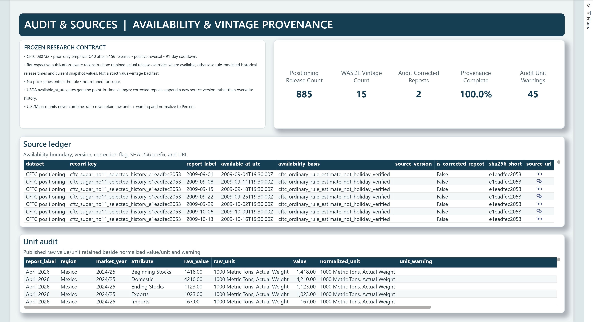

# Sugar No. 11 Power BI report

This is a Power BI Desktop report project, not a published Power BI Service
report. It has two pages:

- **Decision Lens** — the August 2026 U.S. 2026/27 WASDE revision story beside
  managed-money positioning, the prior-only Q10 threshold, and frozen-rule event
  markers.
- **Audit & Sources** — publication availability, genuine USDA point-in-time vintages,
  source version, correction flag, SHA-256 prefix, source URL, and a U.S./Mexico unit
  audit. The CFTC series is explicitly labelled as a retrospective publication-aware
  reconstruction: it uses retained actual release overrides where available and
  otherwise rule-modelled historical release times with current snapshot values. It
  is not a strict value-vintage backtest.

The report states its research limits on the canvas: **PUBLIC DATA**, **NO PRICE
SERIES**, and **RULE NOT RETUNED**.




## Open it

Open `SugarNo11.pbip` with a current Power BI Desktop. A clean PBIP clone has no
committed model cache, so choose **Refresh** once after opening. The semantic model is
generated deterministically from the committed `data/derived` CSVs and embeds their
verified bytes as raw Base64 Power Query payloads. Refresh therefore needs no
machine-specific path, credentials, decompression support, or network access.

For the quickest review, open the committed [SugarNo11.pbix](SugarNo11.pbix). It is a validated
Desktop export with populated import data and needs no refresh, credentials, or network
access. The PBIP/PBIR/TMDL source remains the auditable, deterministically generated
version of the same report. See `VALIDATION.md` for the exact Desktop version, PBIX
hash, reopen checks, and model-query results.

## Rebuild it

Run the repository's deterministic pipeline first, then:

```powershell
python scripts/build_powerbi_project.py
```

The builder validates the expected input columns and rewrites the PBIP/PBIR/TMDL
definitions plus `data_manifest.json`. The manifest pins source CSV hashes, row counts,
embedded-table hashes, the data as-of boundary, and the Desktop version used for final
validation.

## Compatibility and validation

Final validation used Power BI Desktop `2.157.879.0` with PBIP, PBIR, TMDL, and secure
local Desktop API preview support. These project formats remain preview features, so
the PBIX release asset is the most broadly compatible way to review the populated
artifact.

The current Microsoft JSON schemas used for offline report-definition validation are
vendored under `schemas/` at a pinned upstream commit. Microsoft's MIT notice is
reproduced alongside them and remains separate from this repository's own license.

Official format references:

- [Power BI Desktop projects (PBIP)](https://learn.microsoft.com/en-us/power-bi/developer/projects/projects-overview)
- [Power BI enhanced report format (PBIR)](https://learn.microsoft.com/en-us/power-bi/developer/embedded/projects-enhanced-report-format)
- [Tabular Model Definition Language (TMDL)](https://learn.microsoft.com/en-us/analysis-services/tmdl/tmdl-overview)
